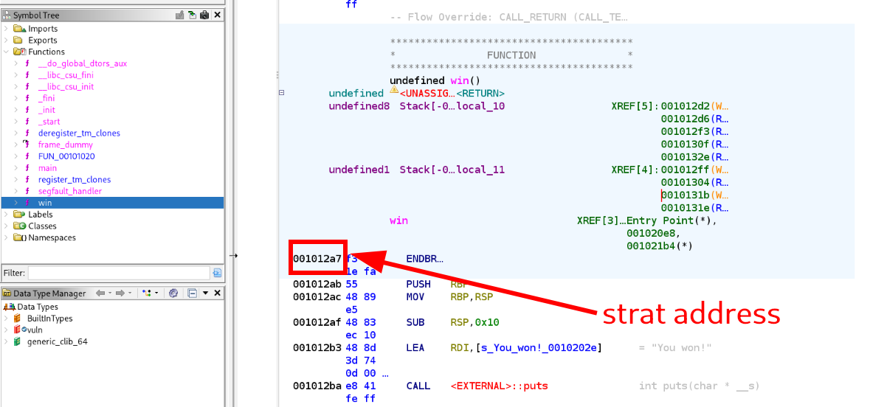

# PicoCTF: Binary Exploitation - PIE Time

## 🎯 Objective
Find the flag by exploiting a binary file of the program

## 🛠️ Tools & Concepts Used
* `nc` - read and write data between two computers
* `chmod +x` - gives executable permission for a file
* `ghidra` - software reverse engineering suite of tools developed by NSA
* `C language` - general purpose programming language
* `Assembly language` - low level programming language
* `PIE` - Position Independent Executable

## 🕳️ Rabbit Holes & Missteps
* **Hypothesis:** Having the C file would suffice for finding the flag
* **Action:** I opened the C file and searched for the flag
* **Result:** I understood the program but did not find the flag directly

* **Hypothesis:** Solving the challenge locally would be the same as via netcat
* **Action:** I tried to feed the local program with the address of win() function
* **Result:** No flag received

## 📝 Step-by-Step Solution

**0. Understanding the challenge**
Running the `nc` command connected me to a remote server which displayed its main address and asked me for the address I want to jump to. There I understood I need to find some kind of an address in order to solve the CTF in the binary file provided.

**1. Inspect the C file**
First, I opened the C file and inspected its content. That is how I discovered there is a `win()` function that will print the flag.

```C
int win() {
  FILE *fptr;
  char c;

  printf("You won!\n");
  // Open file
  fptr = fopen("flag.txt", "r");
  ...
}
```

**2. Open the executable in Ghidra**
Then, using `Ghidra` I opened the binary file and I started to look for the address of the `win()` function.


**3. Search for the main() address**
Then, I did the same for the `main` address. Since the challenge is named `PIE` simply feeding the machine with my address of `win()` would not work, therefore I needed to calculate the distance between main and win (the distance between them is always constant, even though the actual loaded addresses change).

**4. Calculate the distance and feed the program**
Then, I calculated the distance and using the provided main address of the running remote machine I found out the actual address of the win() function. Feeding this to the remote server solved the challenge, the remote machine printing the flag.


## 💡 Key Takeaway
I learned how to use Ghidra to find memory addresses and how to bypass `PIE` by calculating relative offsets. In addition, I learned how to use the `flameshot` tool in Kali Linux to create annotated screenshots for my documentation.